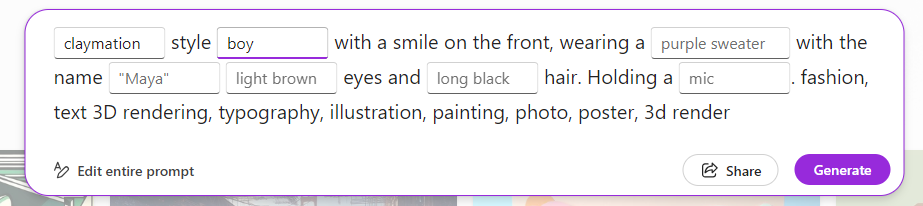

# How to promt you avatar with Zero-Shot Prompts

In this post, I’ll show you how to create a personalized avatar using multiple zero-shot prompts. The process is simple and fun, so grab a beer (or whathever you like to dink, even pure and cristalline water is fine) and follow me trought the results. AIGenerater Avatars, or A(I)vatars as i like to call them, can be quite impressive, let’s get started!

### The first prompt 

Let's start with a simple and pre-configured prompt. This prompt serves as a blueprint for your avatar, outlining its basic features and characteristics of our A(i)vatar.
To start, navigate to [aka.ms/DesignMe](https://aka.ms/DesignMe). Here, you’ll be able to see a pre-compiled prompt, where you shall insert some info in the blank spaces. 

Think of this as the foundation of your avatar. You’re sketching a rough outline that will be refined and detailed in the following steps.

Prompt 1: `Claymation style boy with a smile on the front, wearing a yellow t-shirt with the name Luca, light brown eyes, and short brown hair. Holding a beer. Fashion, text 3D rendering, typography, illustration, painting, photo, poster, 3D render.`

This will give you your first image.

Step 2: Refining the Prompt
Next, add more details to the prompt to refine the image. For instance, you might want to add a white background, a beard, and a Surface computer. The refined prompt could look something like this:

Prompt 2: Claymation-style boy with a smile on the front, wearing a Yellow t-shirt with the name Luca, light brown eyes, and short brown hair, a tiny beard. Holding a beer and a Microsoft Surface device. White background. Fashion, text 3D rendering, typography, illustration, painting, photo, poster, 3D render.

This will give you a more detailed image.

Step 3: Personalizing the Avatar
Now, it’s time to add some personal touches. You might want to change the boy to a slightly athletic man, add a short beard, or specify the type of beer he’s holding. The more specific you are, the more personalized your avatar will be.

Prompt 3: Claymation-style man, slightly athletic, with a smile on the front, wearing a Yellow t-shirt with the name Luca. Light brown eyes, super short brown hair, and a short beard. It holds a pint of beer and a Microsoft Surface device. White background. Fashion, text 3D rendering, typography, illustration, painting, photo, poster, 3D render.

Step 4: Final Touches
Finally, make any last-minute adjustments to perfect your avatar. You might want to specify the size of the nose, the type of beer, or remove any unwanted elements. Remember, the more specific you are, the better the result will be.

Final Prompt: Claymation-style man, slightly athletic, with a big smile on the front, wearing a Yellow t-shirt with the name Luca. Brown eyes, super short brown hair, and a short beard and a small nose. It holds a pint of black stout beer and a Microsoft Surface device. MUST BE A White background WITH NO ELEMENTS, LIKE A PNG. Fashion, text 3D rendering, typography, illustration, painting, photo, poster, 3D render.

Creating the Homepage Avatar
For creating the homepage avatar, I used the following prompt:

Prompt for the homepage avatar: 3D cartoon Man with a Happy smile, standing at an angle, wearing a Blue Polo shirt, Brown Oval eyes, and Super short Brown Solid Cut hair and short brown beard. Holding A pint of beer, sit at a table with a surface laptop in front of it.

Conclusion
Creating a personalized avatar using zero-shot prompts is a fun and creative process. With a bit of imagination and a few tweaks, you can create an avatar that truly represents you. Give it a try and let me know how it goes!